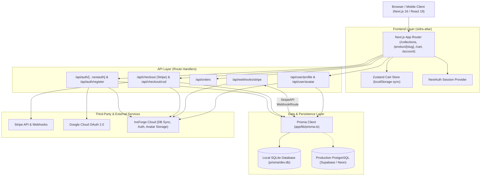

# Product Requirements Document (PRD)
## Project: Sidra Attar Wala (E-Commerce Platform)
**Document Version:** 1.0.0  
**Status:** Active / In Production & Development  
**Target Platform:** Web (Next.js 16 App Router) & Companion Mobile App (React Native/Expo)

---

## 1. Executive Summary & Product Vision

### 1.1 Brand & Product Vision
**Sidra Attar Wala** is a luxury, heritage-inspired e-commerce platform dedicated to pure artisanal attars, oriental perfumery, musk, oudh, and traditional fragrance blends. The platform marries century-old deg-bhapka distillation heritage with a modern digital shopping experience.

The platform serves two primary business models:
1. **Direct-to-Consumer (D2C) Retail:** Individual customers purchasing curated luxury perfumes, single bottles, discovery sets, and gifting items.
2. **Business-to-Business (B2B) Wholesale:** Retailers, resellers, and corporate clients purchasing wholesale volume tiers with automatic bulk discount pricing and dedicated inquiry channels.

### 1.2 Target User Personas
* **The Fragrance Connoisseur (Retail):** Seeking non-alcoholic, pure botanical/oudh attars with high sillage and longevity; values detailed scent notes (Top, Heart, Base notes, occasions, concentration).
* **The Gifting & Festive Shopper:** Looking for premium packaging, custom gift-wrap options, and fast shipping for weddings, Eid, and special celebrations.
* **The Wholesale Reseller (B2B):** Buys bulk inventory (5+, 12+, 24+ units), needs dynamic tiered volume pricing, invoice tracking, and direct WhatsApp / corporate inquiry channels.
* **The Store Administrator / Vendor:** Needs order fulfillment tracking, customer visibility, inventory sync, and order lifecycle management.

---

## 2. System Architecture & Tech Stack

### 2.1 Technology Matrix

| Layer | Technology | Purpose / Justification |
| :--- | :--- | :--- |
| **Frontend Framework** | **Next.js 16.2.3 (App Router)** | High-performance React 19 framework, Turbopack, SSR/SSG for SEO |
| **UI & Styling** | **Tailwind CSS + Vanilla CSS** | Bespoke luxury aesthetic, gold/dark gradients, CSS variables, glassmorphism |
| **Global State** | **Zustand 5.0** | Lightweight shopping cart state management with persistent `localStorage` |
| **Carousel / Sliders** | **Embla Carousel React** | Touch-friendly, high-performance responsive hero banners and product sliders |
| **Backend Runtime** | **Next.js Route Handlers (Node.js)** | Unified serverless API routing (`app/api/*`) for auth, orders, payments |
| **Secondary Backend** | **Express 5.2 (TypeScript)** | Standalone microservice in `backend/` with Drizzle/Prisma, Sentry, ImageKit |
| **Database & ORM** | **Prisma ORM 6.19** | Type-safe data access, migrations, schema modeling |
| **Databases** | **SQLite (Dev) / PostgreSQL (Prod)** | Zero-latency local development (`dev.db`) + Supabase/Neon PostgreSQL in cloud |
| **Authentication** | **NextAuth.js 4.24 (Auth.js)** | Credentials login (bcrypt hashed) + Google OAuth provider |
| **External BaaS** | **InsForge SDK** | Cloud database sync, user auto-provisioning, and S3-compatible Avatar storage |
| **Payments** | **Stripe + Cash on Delivery + UPI** | Stripe Checkout (Cards, International) + COD workflow + UPI routing |
| **Deployment** | **Vercel** | Edge network deployment, automated CI/CD from Git |

---

### 2.2 System Architecture Diagram



---

## 3. Frontend Specifications & User Interface

### 3.1 Luxury Design System & Tokens
* **Color Palette:**
  * Primary Accent: Imperial Gold (`#D4AF37`, `#B8972E`)
  * Surface Dark: Deep Obsidian (`#0C0B0A`, `#161412`, `#1F1C18`)
  * Surface Light: Warm Ivory / Pearl (`#FAF8F5`, `#F3EFEA`)
  * Outline Variant: Muted Brass / Gold Borders
* **Typography:**
  * Headline: Classic Serif / Display (`Playfair Display`, `Cinzel`, or `Cormorant Garamond`)
  * Body & Metadata: Modern Sans-Serif (`Inter`, `Plus Jakarta Sans`)
* **Visual Elements:**
  * Dynamic Glassmorphic Navigation Bar with scroll threshold blur.
  * Interactive Scent Bottle Visualizer with liquid gradients matching fragrance profiles.
  * Micro-animations on Add to Cart, Drawer transitions, and Toast notifications.

---

### 3.2 Page-by-Page Functional Requirements

#### 1. Home Page (`/`)
* **Hero Carousel:** Embla-powered luxury slider with 5000ms autoplay displaying featured master fragrances (Midnight Oud, Gulistan Rose, Kashmiri Musk) with CTA buttons.
* **Brand Story & Deg-Bhapka Heritage:** Educational section on natural distillation, pure sandalwood bases, and non-alcoholic formulation.
* **Bestsellers Grid:** Interactive product cards showing retail price, discount badge, quick Add-to-Cart.
* **Customer Testimonials & Social Proof:** Verified customer ratings, notes, and reviews.
* **Offer Ticker:** Top banner for flash offers (e.g., Free Shipping above ₹999, Festive Promo Codes).

#### 2. Product Catalog & Collections (`/collections`)
* **Category Filtering:** Filter by fragrance family:
  * *Royal Oud* (Dehn Al Oud, Cambodi, Assam Oudh)
  * *Floral & Rose* (Taif Rose, Ruh Gulab, Jasmine Sambac)
  * *Musk & Amber* (White Musk, Kashmiri Kasturi, Black Amber)
  * *Mukhallat & Blends* (Royal Heritage, Desert Sultan)
  * *Artisanal & Rare* (Sandalwood extracts, aged distillates)
* **Sorting:** Sort by Price (Low to High, High to Low), Newest, Bestselling.
* **Search:** Real-time query search filtering product names, tags, and profiles.

#### 3. Product Detail Page (`/product/[slug]`)
* **High-Res Media Showcase:** Responsive image gallery or custom bottle gradient visualizer.
* **Fragrance Architecture Profile:**
  * Top Notes, Heart Notes, Base Notes
  * Longevity (e.g., *12-16 Hours*), Sillage (*Heavy / Intimate*), Concentration (*100% Pure Oil / Attar*)
  * Recommended Occasions (Daily, Evening, Bridal, Prayer/Spiritual)
* **Dynamic Wholesale Tier Table:** Automatic breakdown of volume pricing:
  * 1 - 4 Units: Retail Price
  * 5 - 11 Units: ~12% Volume Discount
  * 12 - 23 Units: ~23% Volume Discount
  * 24+ Units: ~32% Volume Discount
* **Add to Cart & Quantity Selector:** Instant addition to Zustand store with drawer slide-in.
* **Related Products:** Intelligent recommendations from the same fragrance family.

#### 4. Shopping Cart & Drawer (`/cart` & `CartDrawer.tsx`)
* **State Management:** Reactive Zustand cart persisted in browser storage.
* **Cart Calculations:**
  * Subtotal calculation
  * Automatic Free Shipping logic (Orders $\ge$ ₹999 get free shipping; otherwise flat ₹99)
  * Volume discount calculations
* **Checkout Options:**
  1. Credit / Debit Card (Stripe Checkout)
  2. Cash on Delivery (COD)
  3. Direct UPI Payment
* **Delivery Address Capture:** Integrated customer name, phone number, shipping address, pincode.

#### 5. Authentication Portal (`/auth/signin` & `/auth/signup`)
* **Modes:** Unified Sign In / Sign Up interface with toggle.
* **Credential Login:** Email & Password with client-side validation and bcrypt server verification.
* **OAuth Login:** One-click Google Sign In.
* **Redirects:** Smart redirection back to intended page (e.g. `/checkout` or `/account`).

#### 6. Customer Account Portal (`/account`, `/account/orders`, `/account/orders/[id]`)
* **User Dashboard:** Order summary metrics (Total Orders, Total Spent, Profile details).
* **Avatar Management:** Photo upload with InsForge Storage and instant avatar update.
* **Order Tracking Timeline:** Visual step progression:
  1. `PLACED` / `PENDING` (Order confirmed)
  2. `PROCESSING` (Fragrance bottling & packaging)
  3. `SHIPPED` (Out with logistics courier)
  4. `DELIVERED` (Fulfilled successfully)
* **Detailed Order Receipt:** Full line-item breakdown, quantities, historical unit prices, shipping details, and payment method badge.

#### 7. B2B Wholesale Portal (`/wholesale`)
* **Bulk Order Inquiries:** Dedicated B2B form capturing Business Name, GSTIN, Estimated Volume, Fragrance Requirements.
* **Tier Guidelines:** Explanation of minimum order quantities (MOQ) and custom private-label bottling.

---

## 4. Backend Specifications & API Endpoints

### 4.1 REST API Routes (`sidra-attar/app/api`)

#### Authentication Endpoints
* **`POST /api/auth/register`**
  * *Request:* `{ name, email, password }`
  * *Validation:* Minimum 6-character password, email uniqueness check.
  * *Action:* Hashes password with bcrypt (12 rounds), creates Prisma `User`, syncs customer to InsForge.
  * *Response:* `201 Created` with user payload.
* **`POST /api/auth/[...nextauth]`**
  * NextAuth handler managing session tokens, Google OAuth callback, and JWT creation.

#### Checkout & Payment Endpoints
* **`POST /api/checkout` (Stripe)**
  * *Auth:* Required (Session check).
  * *Request:* `{ items: [{ id, name, price, quantity, slug }] }`
  * *Action:* Computes subtotal + shipping, creates Prisma `Order` with `PENDING` status, provisions Stripe Checkout session with line items and metadata (`orderId`), syncs order to InsForge.
  * *Response:* `{ url: stripeCheckoutUrl }`
* **`POST /api/checkout/cod` (Cash on Delivery & UPI)**
  * *Auth:* Required.
  * *Request:* `{ items, paymentMethod: "COD" | "UPI" }`
  * *Action:* Creates `Order` with `status: "PENDING_COD"` or `"PENDING_UPI"`, generates order items, updates InsForge.
  * *Response:* `{ success: true, orderId, message: "Order placed successfully" }`
* **`POST /api/webhooks/stripe`**
  * *Headers:* `stripe-signature` verification.
  * *Action:* Handles `checkout.session.completed`, marks `Order.status = "PAID"` in Prisma and InsForge.
  * *Response:* `{ received: true }`

#### Order Management Endpoints
* **`GET /api/orders`**
  * *Auth:* Required.
  * *Response:* List of authenticated user orders with associated items and product references.

#### User Profile Endpoints
* **`PUT /api/user/profile`**
  * *Auth:* Required.
  * *Request:* `{ name: string }`
  * *Action:* Updates user display name in Prisma database.
* **`POST /api/user/avatar`**
  * *Auth:* Required.
  * *Request:* Multipart `FormData` with image file.
  * *Action:* Uploads binary buffer to InsForge Storage bucket (`avatars/`), retrieves public URL, updates `User.image` in Prisma and InsForge.

---

## 5. Database Schema & Data Models (Prisma ORM)

```prisma
// Datasource: SQLite (Dev) / PostgreSQL (Production)
datasource db {
  provider = "sqlite" // Or "postgresql"
  url      = env("DATABASE_URL")
}

model User {
  id             String    @id @default(cuid())
  name           String?
  email          String?   @unique
  emailVerified  DateTime?
  image          String?
  hashedPassword String?
  role           String    @default("USER") // USER | ADMIN | WHOLESALE
  accounts       Account[]
  sessions       Session[]
  orders         Order[]
}

model Account {
  id                String  @id @default(cuid())
  userId            String
  type              String
  provider          String
  providerAccountId String
  refresh_token     String?
  access_token      String?
  expires_at        Int?
  token_type        String?
  scope             String?
  id_token          String?
  session_state     String?
  user              User    @relation(fields: [userId], references: [id], onDelete: Cascade)

  @@unique([provider, providerAccountId])
}

model Session {
  id           String   @id @default(cuid())
  sessionToken String   @unique
  userId       String
  expires      DateTime
  user         User     @relation(fields: [userId], references: [id], onDelete: Cascade)
}

model Product {
  id              String      @id @default(cuid())
  slug            String      @unique
  name            String
  price           Float
  originalPrice   Float?
  category        String
  description     String
  story           String
  gradient        String
  accent          String
  badge           String?
  image           String?
  tags            String      // JSON stringified array of tags
  wholesalePrices String?     // JSON stringified array of tier objects
  profile         String?     // JSON stringified key-value notes
  occasions       String      // JSON stringified array of occasions
  createdAt       DateTime    @default(now())
  updatedAt       DateTime    @updatedAt
  orderItems      OrderItem[]
}

model Order {
  id              String      @id @default(cuid())
  userId          String
  stripeSessionId String?     @unique
  totalAmount     Float
  paymentMethod   String      @default("COD") // CARD | COD | UPI
  status          String      @default("PENDING") // PENDING | PAID | PROCESSING | SHIPPED | DELIVERED
  createdAt       DateTime    @default(now())
  updatedAt       DateTime    @updatedAt
  user            User        @relation(fields: [userId], references: [id])
  items           OrderItem[]
}

model OrderItem {
  id        String  @id @default(cuid())
  orderId   String
  productId String
  quantity  Int
  price     Float
  order     Order   @relation(fields: [orderId], references: [id], onDelete: Cascade)
  product   Product @relation(fields: [productId], references: [id])
}

model VerificationToken {
  identifier String
  token      String   @unique
  expires    DateTime

  @@unique([identifier, token])
}
```

---

## 6. Order Lifecycle State Machine

```
              ┌───────────────┐
              │  Cart Order   │
              │  Initiated    │
              └───────┬───────┘
                      │
        ┌─────────────┴─────────────┐
        ▼                           ▼
 ┌──────────────┐            ┌──────────────┐
 │ Stripe Card  │            │ COD / UPI    │
 └──────┬───────┘            └──────┬───────┘
        │                           │
        ▼                           ▼
 ┌──────────────┐            ┌──────────────┐
 │   PENDING    │            │ PENDING_COD  │
 │ (Awaiting    │            │ PENDING_UPI  │
 │  Payment)    │            └──────┬───────┘
 └──────┬───────┘                   │
        │ Webhook: Completed        │ Admin / Vendor Confirm
        ▼                           ▼
 ┌──────────────────────────────────────────┐
 │              CONFIRMED / PAID            │
 └────────────────────┬─────────────────────┘
                      │ Bottling & Dispatch
                      ▼
 ┌──────────────────────────────────────────┐
 │               PROCESSING                 │
 └────────────────────┬─────────────────────┘
                      │ Handover to Courier
                      ▼
 ┌──────────────────────────────────────────┐
 │                 SHIPPED                  │
 └────────────────────┬─────────────────────┘
                      │ Final Delivery
                      ▼
 ┌──────────────────────────────────────────┐
 │                DELIVERED                 │
 └──────────────────────────────────────────┘
```

---

## 7. Security, Performance & Data Resilience

1. **Database Fallback Pattern:**
   * In [`app/lib/products.ts`](file:///c:/Users/maruf/anaconda3/Desktop/Projects/Antigravity/Sidra/sidra-attar/app/lib/products.ts), all database queries are wrapped with `try/catch`.
   * If the primary database is momentarily unreachable during maintenance or cold starts, the system automatically falls back to curated static catalogue data in `app/data/products.ts`. Zero downtime for browsing customers.
2. **Password Security:**
   * Passwords are never stored in plain text. Salting and hashing are performed using `bcryptjs` with 12 rounds.
3. **Session & JWT Protection:**
   * NextAuth tokens are signed with `NEXTAUTH_SECRET`.
   * Sessions use HTTP-only, secure, same-site cookies to safeguard against XSS attacks.
4. **Stripe Webhook Signature Verification:**
   * Every incoming webhook payload is validated against `STRIPE_WEBHOOK_SECRET` before updating order states to prevent spoofed transactions.
5. **Image Optimization & Delivery:**
   * Next.js `<Image />` component with automatic WebP/AVIF transcoding, responsive `sizes`, and lazy loading.

---

## 8. Mobile Companion App Roadmap (React Native / Expo)

As established in the companion architecture guide (`Sidra-attar_App_Guide.docx`):
* **Stack:** React Native + Expo (EAS Build), React Navigation, MMKV local cache.
* **Biometric Auth:** FaceID / TouchID for quick re-authentication.
* **Native Payments:** Stripe Mobile SDK for in-app Apple Pay & Google Pay.
* **Push Notifications:** Firebase Cloud Messaging (FCM) triggered on `SHIPPED` and `DELIVERED` webhook status updates.
* **WhatsApp Deep Linking:** Single-tap inquiry sharing for B2B wholesale products.

---

## 9. Verification & Acceptance Criteria

| Feature | Acceptance Criteria |
| :--- | :--- |
| **Product Browsing** | Home page & Collections render 42+ products with prices, images, and fragrance profiles. |
| **Wholesale Tiers** | Selecting $\ge$5, 12, or 24 items in PDP displays discounted tier unit prices. |
| **Cart Persistence** | Items added to cart remain saved across browser reloads via `localStorage`. |
| **Free Shipping** | Free shipping automatically triggers when subtotal exceeds ₹999. |
| **User Sign-Up** | User can register via `/auth/signup`, record is stored in Prisma and synced with InsForge. |
| **User Sign-In** | User can authenticate with credentials or Google OAuth; session persists across pages. |
| **Stripe Checkout** | Card payments redirect to secure Stripe hosted session and return to `/checkout/success`. |
| **COD Checkout** | Users can complete cash-on-delivery orders, view them in `/account/orders`. |
| **Order Tracking** | Customer can view real-time timeline (`PLACED` $\to$ `PROCESSING` $\to$ `SHIPPED` $\to$ `DELIVERED`). |
| **Profile Photo Upload** | Uploading an avatar updates user profile in database and reflects in the header avatar. |
